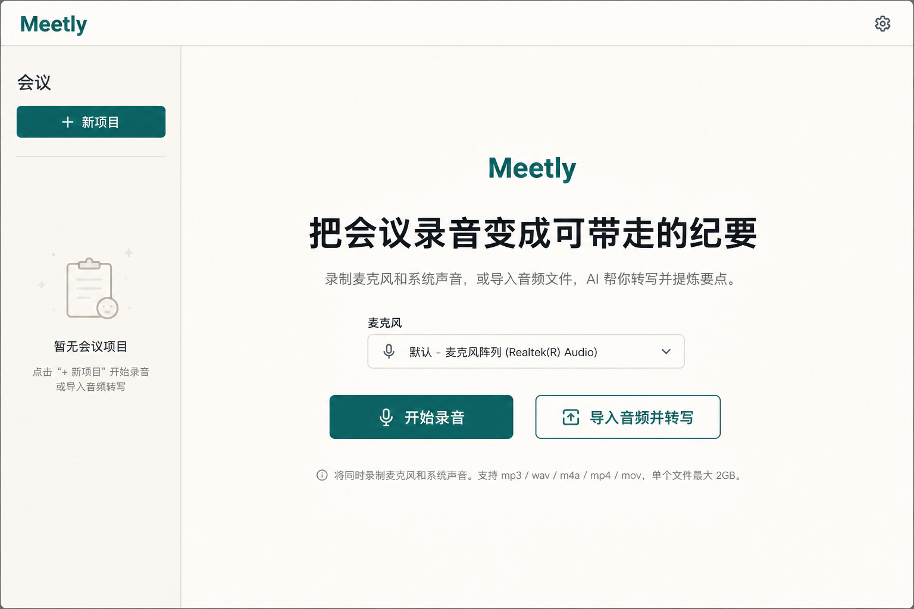
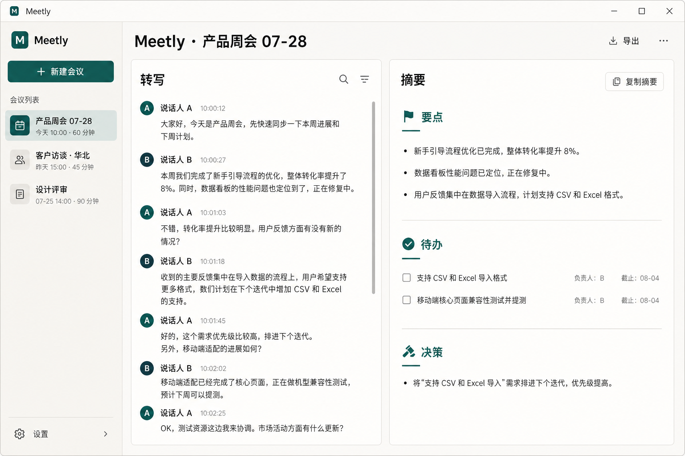
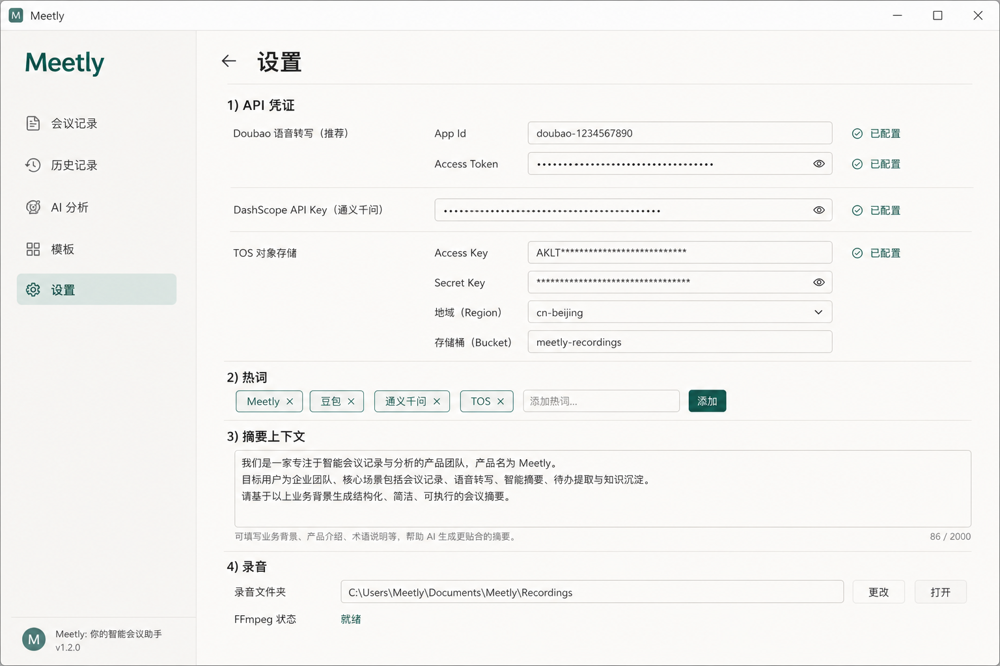

# Meetly

**把会议录音变成可带走的纪要**

[English](./README.md)

<p align="center">
  
</p>

Meetly 是一款本地优先的桌面会议助手：录制麦克风 + 系统声音，或导入音频，一键完成 **转写 → 结构化摘要**（要点 / 待办 / 决策）。

## 为什么选 Meetly

| | |
|---|---|
| **一键开录** | 同时捕获麦克风与系统扬声器（对方声音），停录即自动建会并转写 |
| **导入也行** | 本地音频直接导入转写，小文件走极速通道，大文件走 TOS 异步识别 |
| **纪要可带走** | 通义千问生成「要点 / 待办 / 决策」，复制即用 |
| **本地优先** | SQLite 存会议与设置；密钥只进系统钥匙串，不写数据库 |
| **热词加持** | 专有名词、产品名进热词表，转写更准 |

<p align="center">
  
</p>

## 功能一览

- **录音**：WASAPI loopback 混录 → M4A（有 FFmpeg）或 WAV 兜底
- **转写**：豆包语音 · ≤20 MiB 极速识别 · 更大文件经 TOS 异步提交（最长轮询 45 分钟）
- **摘要**：DashScope / 通义千问 `qwen3.7-plus`，输出要点、待办、决策
- **工作区**：侧栏会议列表 + 转写 / 摘要分栏（窄屏自动切 Tab）
- **设置**：凭证、热词、摘要上下文、录音目录、FFmpeg 状态

<p align="center">
  
</p>

## 快速开始

**环境要求**

- [Node.js](https://nodejs.org/) 20+（npm）
- [Rust](https://rustup.rs/) stable（Windows 请用 MSVC：`rustup default stable-x86_64-pc-windows-msvc`）
- Windows：Visual Studio Build Tools（「使用 C++ 的桌面开发」）+ WebView2（Win10/11 通常已预装）

```bash
npm install
npm run tauri dev
```

Vite 会在 `http://localhost:1420` 启动，并打开 Meetly 窗口。

在 **设置** 中配置：

| 用途 | 服务 | 需要什么 |
|------|------|----------|
| 转写 | 豆包 | App Id + Access Token |
| 大文件转写 | 火山引擎 TOS | AK/SK（钥匙串）+ region / bucket |
| 摘要 | 通义千问 / DashScope | API Key |

凭证经系统钥匙串保存，**不会**写入 SQLite，也**不会**被 `settings_get` 回传。

## 日常用法

1. 选好麦克风 → **开始录音**（或 **导入音频并转写**）
2. 停录后自动建会并启动转写
3. 转写完成后点 **生成摘要**，复制纪要带走

## Windows 安装包

同一应用 ID，两种 NSIS 安装包（安装其一会替换另一）：

| 产物 | 内容 | 适用场景 |
|------|------|----------|
| `Meetly_<ver>_x64-setup.exe`（**精简**，默认） | 仅应用 | 日常安装；首次需要时再下载 FFmpeg（约 80–100 MiB） |
| `Meetly_<ver>_x64-offline-setup.exe` | 应用 + 内置 FFmpeg | 弱网 / 离线环境 |

```bash
npm run ffmpeg:prepare   # 缓存 pinned essentials 构建
npm run pack:lean        # 精简包
npm run pack:offline     # 离线包
npm run pack:all         # 两者 → dist-installers/
```

推送版本 tag（或 Actions → Release → Run workflow）可触发 CI 构建并上传产物。

## 转写说明（简）

| 文件大小 | 路径 |
|----------|------|
| ≤ 20 MiB | 豆包 flash 识别（base64） |
| 20 MiB–512 MiB | 上传 TOS → 预签名 URL → 豆包异步识别 |
| > 512 MiB | `ASR_PAYLOAD_TOO_LARGE` |

热词发给 ASR；`context_text` 只用于摘要，**不**发给豆包 ASR。

## 开发与测试

```bash
npm test
npm run typecheck
cd src-tauri && cargo test
```

```
src/          React UI（app / pages / features / ipc / shared）
src-tauri/    Tauri 命令、服务、SQLite、供应商适配
```

## 技术栈

Tauri 2 · React 19 · TypeScript · Vite · SQLite · 豆包语音 · 通义千问 · 系统钥匙串

---

<p align="center">
  <sub>界面预览见 <code>docs/screenshots/</code> · v0.1.0</sub>
</p>
