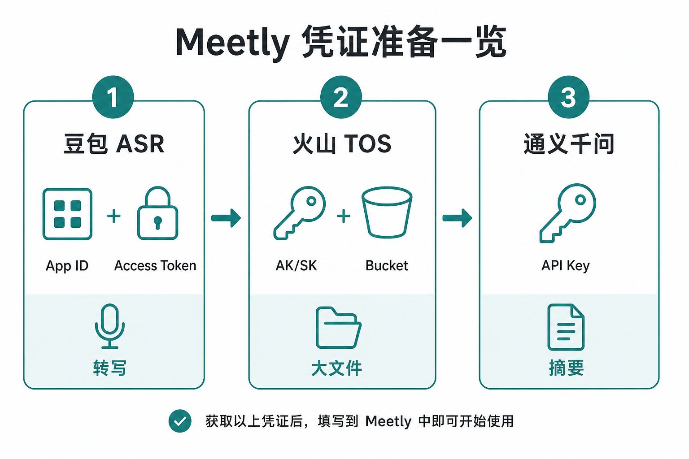
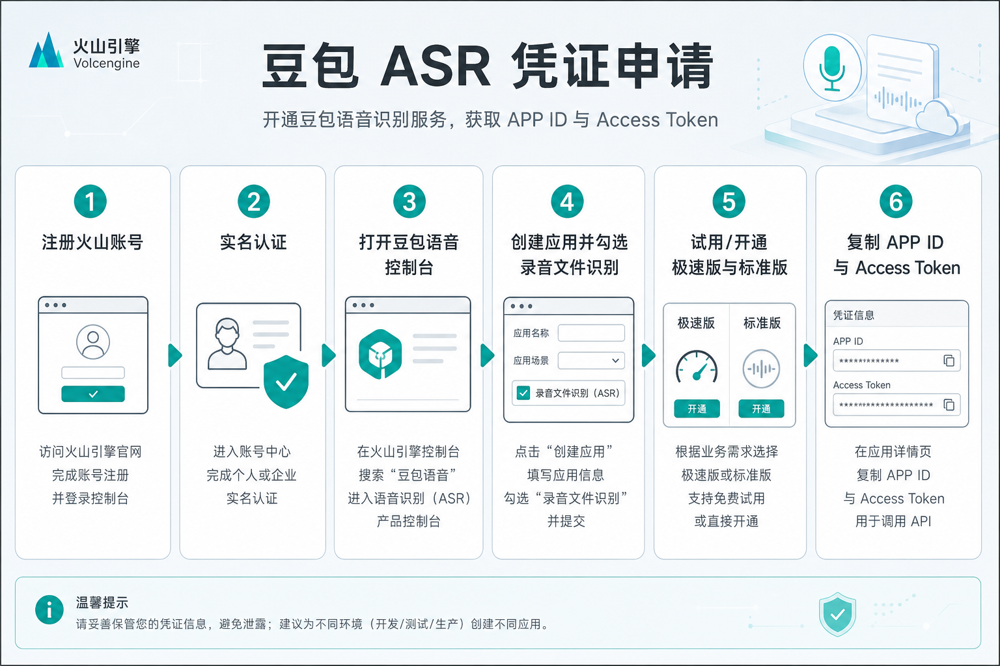
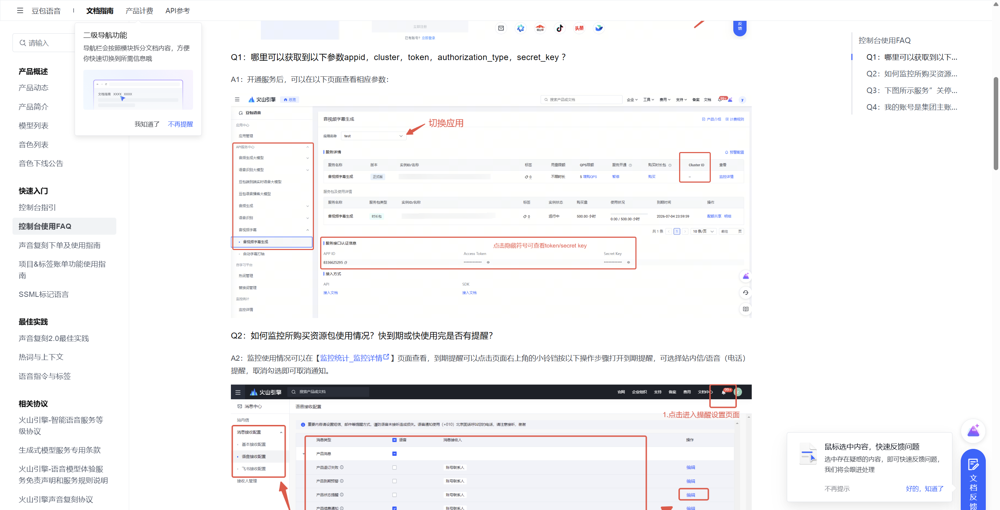
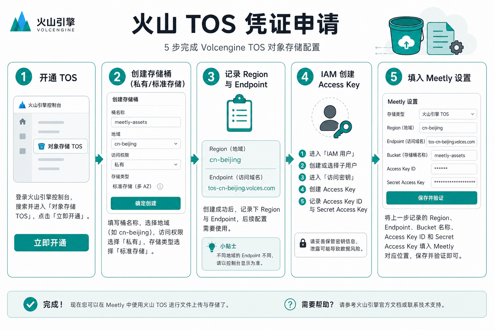
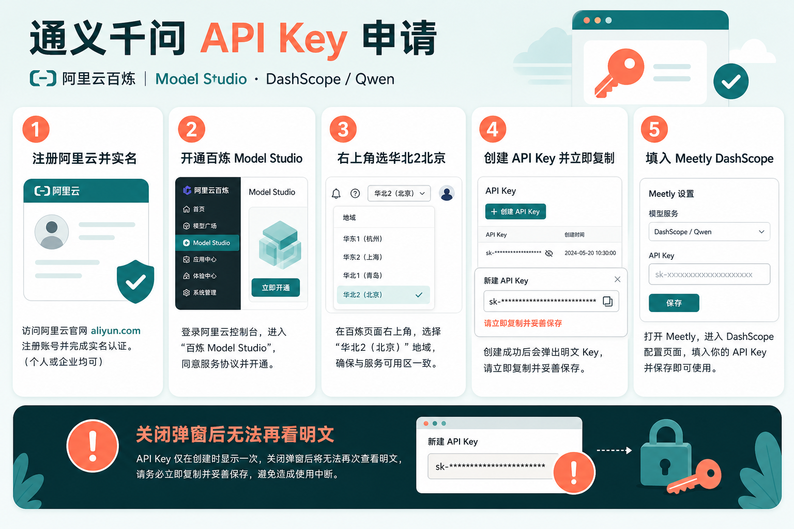
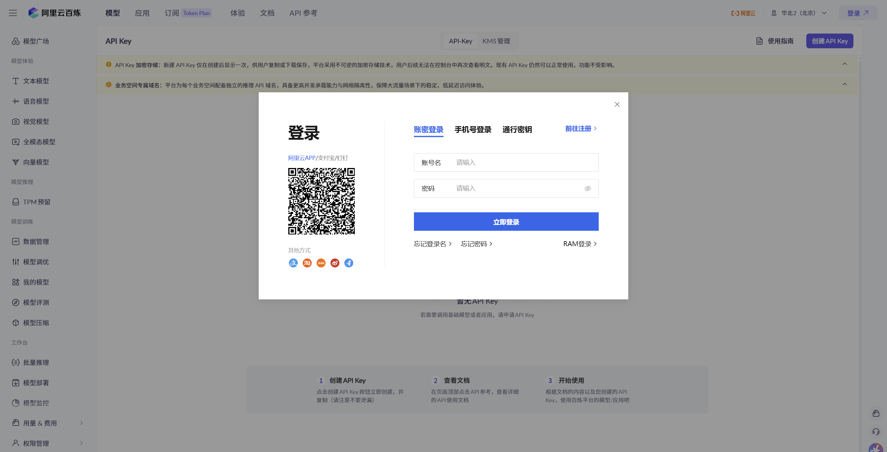

# Meetly 凭证申请图文指南（小白版）

本文面向第一次配置 Meetly 的用户，按 **2026 年各平台当前控制台流程** 说明如何申请：

1. **豆包 ASR**（App Id + Access Token）— 音频转写  
2. **火山 TOS**（AK/SK + Region + Bucket）— 大文件（>20 MiB）转写上传  
3. **通义千问 / 阿里云百炼 API Key** — 会议摘要  

> 流程以官方控制台为准；若界面文案略有改动，以控制台实际按钮为准。  
> 密钥类信息只应粘贴进 Meetly **设置**，不要发到聊天群、截图公开或提交到 Git。

---

## 你需要准备什么？

| 用途 | 平台 | Meetly 设置里填什么 | 是否必须 |
|------|------|---------------------|----------|
| 转写（≤20 MiB 极速） | 火山引擎 · 豆包语音 | App Id、Access Token | **必须**（要转写就需要） |
| 转写（20 MiB–512 MiB） | 火山引擎 · TOS | Access Key Id、Secret Access Key、Region、Bucket | 仅大文件需要 |
| 摘要 | 阿里云百炼 · DashScope | API Key | **必须**（要生成纪要就需要） |

<p align="center">
  
</p>

<p align="center">
  
</p>

Meetly 里对应三个区块：**豆包凭证**、**火山 TOS**、**通义千问 / DashScope**。填完后建议分别点 **测试连接**。

---

## 第一部分：豆包 ASR（App Id + Access Token）

<p align="center">
  
</p>

### 1. 注册并实名认证火山引擎

1. 打开 [火山引擎注册页](https://console.volcengine.com/auth/signup)，用手机号完成注册。  
2. 登录 [火山引擎控制台](https://console.volcengine.com/)。  
3. 完成 **实名认证**（个人可用支付宝等快捷认证）。未实名通常无法正常开通豆包语音试用/正式服务。

### 2. 进入豆包语音控制台并创建应用

1. 打开豆包语音应用页：  
   **[https://console.volcengine.com/speech/app](https://console.volcengine.com/speech/app)**  
2. 点击 **创建应用**。  
3. 填写：  
   - **应用名称**：英文或拼音即可，例如 `meetly`  
   - **应用简介**：随意，例如「个人会议转写」  
4. **接入能力**请至少勾选与录音文件识别相关的能力（名称可能类似）：  
   - **录音文件识别 / 大模型录音文件识别**（含极速版、标准版）  
   - 若列表里能看到「录音文件极速版」「录音文件识别标准版」，一并勾选  
5. 确认创建。

> 一个火山账号下应用数量有上限（官方文档常见说明为最多约 10 个），请勿重复乱建。

官方总览也可参考：[快速入门（旧版控制台）](https://www.volcengine.com/docs/6561/163043)。

### 3. 开通「试用」或正式版服务

创建应用后，多数服务默认是 **试用版**（有免费额度，适合个人试用）。

1. 在左侧 **API 服务中心 / 语音服务** 中，进入与 **录音文件识别** 相关的服务页。  
2. 顶部用 **切换应用** 选中你刚建的应用。  
3. 对以下能力点击 **试用** / **开通**（以控制台实际名称为准）：  
   - **录音文件极速版**（Meetly 小文件路径，资源 ID：`volc.bigasr.auc_turbo`）  
   - **录音文件识别标准版**（Meetly 大文件异步路径，资源 ID：`volc.bigasr.auc`）  

**说明：**

- 试用额度用完后，需要开通正式版并按量计费；开通正式版时试用赠送用量可能清零，请仔细看弹窗说明。  
- 欠费可能导致服务关停甚至回收；回收后通常要新建应用再开通。详见 [控制台使用 FAQ](https://www.volcengine.com/docs/6561/196768)。

### 4. 复制 App Id 与 Access Token

开通服务后，在同一服务详情页下方（或「服务接入入口及凭证」区域）可以看到：

| 控制台字段 | 填到 Meetly |
|------------|-------------|
| **APP ID** | App Id |
| **Access Token**（常被眼睛图标遮住） | Access Token |

官方 FAQ 截图示意（红框位置即为凭证区）：

<p align="center">
  
</p>

操作提示：

1. 确认顶部已切换到正确 **应用**。  
2. 点击 Access Token 旁的 **眼睛** 显示明文。  
3. 复制到 Meetly → **设置 → 豆包凭证**。  
4. 点 **保存凭证**，再点 **测试连接**。

官方说明：[控制台使用 FAQ · Q1](https://www.volcengine.com/docs/6561/196768)。

### 5. 关于「新版控制台」与 API Key（重要）

火山引擎豆包语音已推出 **新版控制台**，部分文档改为只用 **`X-Api-Key`（API Key）** 鉴权。

**当前 Meetly 使用的是「App Id + Access Token」这对旧版控制台凭证**（请求头 `X-Api-App-Key` / `X-Api-Access-Key`），与官方[录音文件极速版识别 HTTP](https://www.volcengine.com/docs/6561/1631584) 中的「旧版本控制台」写法一致。

因此请你：

- 优先在能看到 **APP ID / Access Token** 的语音控制台页面取凭证（上文链接 `speech/app` 及服务详情页）；  
- **不要**把百炼的 `sk-...`、火山云账号的 TOS AK、或新版语音 **仅 API Key** 误填进「豆包 App Id / Access Token」；  
- 若你的账号已完全切到新版且页面上再也看不到 Access Token，请保留新版 API Key，并关注 Meetly 后续版本是否支持新版鉴权；当前请通过旧版/兼容入口获取 App Id + Token，或联系火山语音支持确认兼容方式。

---

## 第二部分：火山 TOS（大文件转写）

仅当你需要转写 **大于 20 MiB** 的音频时才必须配置。小文件只配豆包即可。

<p align="center">
  
</p>

### 1. 开通对象存储 TOS

1. 登录火山引擎控制台。  
2. 搜索并进入 **对象存储 TOS**，或打开：  
   **[https://console.volcengine.com/tos](https://console.volcengine.com/tos)**  
3. 按提示 **开通服务**（首次进入通常需要确认开通）。

### 2. 创建存储桶（Bucket）

1. 点击 **创建桶**。  
2. 建议配置（个人自用）：  

| 项 | 建议值 | 说明 |
|----|--------|------|
| 桶名称 | 全局唯一，如 `meetly-audio-你的名字缩写` | 仅小写字母、数字、短横线；3–63 字符 |
| 地域 | **华北2（北京）** → Region ID：`cn-beijing` | 与 Meetly 默认 Endpoint 规则一致即可 |
| 存储类型 | **标准存储** | 临时上传会议音频足够 |
| 访问权限 | **私有** | Meetly 用预签名 URL 给豆包拉取，无需公有读 |

3. 创建完成后，在桶概览里记下：  
   - **Bucket 名称**  
   - **Region**（例如 `cn-beijing`）  
   - **外网 Endpoint**（北京一般为 `tos-cn-beijing.volces.com`）

地域与域名官方表：[地域和访问域名](https://www.volcengine.com/docs/6349/107356)。

Meetly 在 **Endpoint 留空** 时会自动使用：

```text
https://tos-{region}.volces.com
```

例如 Region 填 `cn-beijing` → `https://tos-cn-beijing.volces.com`。一般 **不必手填 Endpoint**；仅在你使用自定义域名或特殊网络时再填。

> 不要填带 `tos-s3-` 前缀的 S3 兼容域名，除非你明确知道自己在用 S3 协议客户端；Meetly 使用火山 TOS SDK，默认是标准 Endpoint。

### 3. 创建 Access Key（AK / SK）

TOS 上传鉴权用的是 **火山引擎云账号 Access Key**，不是豆包语音的 Access Token。

**推荐（更安全）：给子用户开最小权限密钥**

1. 右上角头像 → **访问控制**（IAM），或打开：  
   **[https://console.volcengine.com/iam](https://console.volcengine.com/iam)**  
2. **用户** → **新建用户**（可勾选「编程访问」以便生成密钥）。  
3. 为该用户添加权限策略，至少包含 TOS 读写能力，例如系统策略 **`TOSFullAccess`**（个人自用最简单）；生产环境可改为只授权你的那个桶。  
4. 进入该用户 → **密钥** → **新建密钥**。  
5. 立刻复制并保存：  
   - **Access Key ID**  
   - **Secret Access Key**（**只显示一次**，关掉就看不到明文）

**也可（更省事但不推荐长期用）：** 头像 → **API 访问密钥**，为主账号创建密钥。主账号密钥权限过大，泄露风险更高。

官方说明：[Access Key（密钥）管理](https://www.volcengine.com/docs/6291/65568)。

### 4. 填入 Meetly 并测试

在 Meetly **设置 → 火山 TOS**：

| 字段 | 填什么 |
|------|--------|
| Access Key Id | 上一步的 AK |
| Secret Access Key | 上一步的 SK |
| Region | 如 `cn-beijing` |
| Bucket | 你创建的桶名 |
| Endpoint | 可留空 |

保存后点 **测试连接**。失败时优先检查：Region 与桶是否一致、AK/SK 是否复制完整、子用户是否具备 TOS 权限、桶名是否拼写正确。

---

## 第三部分：通义千问 API Key（阿里云百炼 / DashScope）

Meetly 摘要调用 DashScope 兼容接口，模型为 **`qwen3.7-plus`**。你需要的是 **阿里云百炼 API Key**，不是火山引擎密钥。

<p align="center">
  
</p>

### 1. 注册阿里云并实名

1. 打开 [阿里云注册](https://account.aliyun.com/register/qr_register.htm) 完成账号注册。  
2. 完成 **实名认证**（个人刷脸通常很快）。未实名无法开通百炼。

### 2. 开通阿里云百炼（Model Studio）

1. 使用 **主账号** 打开百炼产品页：  
   **[https://www.aliyun.com/product/bailian](https://www.aliyun.com/product/bailian)**  
   或直接进控制台：  
   **[https://bailian.console.aliyun.com/](https://bailian.console.aliyun.com/)**  
2. 阅读并同意服务协议，完成开通。若未弹出协议，说明多半已经开通。  
3. 新用户常有免费 Token 额度（以控制台活动页为准；常见说明为华北2（北京）地域可用）。

官方「首次调用」总览：[首次调用千问 API](https://help.aliyun.com/zh/model-studio/first-api-call-to-qwen)。

### 3. 选择地域并创建 API Key

1. 进入 **API Key** 管理页（北京地域示例）：  
   **[https://bailian.console.aliyun.com/?tab=model#/api-key](https://bailian.console.aliyun.com/?tab=model#/api-key)**  
2. 页面 **右上角** 将地域选为 **华北2（北京）**。Meetly 默认走国内 DashScope 端点，请用北京地域的 Key。  
3. 点击 **创建 API Key**。  
4. 建议：  
   - **归属业务空间**：默认业务空间  
   - **权限**：选 **全部**（个人自用最省事）  
5. 创建成功后弹窗会显示完整 Key（可能是 `sk-` 或升级后的 `sk-ws` 开头）。  
6. **立刻复制保存**。官方说明：关闭弹窗后 **无法再查看明文**；丢失只能重置或新建。

控制台入口示意（需登录后才能看到完整列表；下图为 API Key 页与登录框示意）：

<p align="center">
  
</p>

官方文档：[如何获取 API Key](https://help.aliyun.com/zh/model-studio/get-api-key)。

> **不要**把 Token Plan / Coding Plan 的 `sk-sp-` 专用 Key 和按量付费 Key 搞混；Meetly 使用的是百炼 **按量付费** API Key。

### 4. 填入 Meetly 并测试

1. 打开 Meetly → **设置 → 通义千问 / DashScope**。  
2. 粘贴 API Key → **保存 API Key**。  
3. 点 **测试连接**。  
4. 转写完成的会议即可点 **生成摘要**。

Meetly 会把 Key 存在本机系统钥匙串，**不会**写进 SQLite，也 **不会** 被 `settings_get` 回传明文。

---

## 配置完成后怎么自检？

按顺序做：

1. **豆包** → 测试连接成功 → 导入一段 **小于 20 MiB** 的音频，应能出转写。  
2. （可选）**TOS** → 测试连接成功 → 再试一段 **大于 20 MiB** 的音频。  
3. **DashScope** → 测试连接成功 → 在有转写的会议上点 **生成摘要**。

| 文件大小 | 需要什么 |
|----------|----------|
| ≤ 20 MiB | 仅豆包 |
| 20 MiB–512 MiB | 豆包 + TOS |
| > 512 MiB | 不支持（`ASR_PAYLOAD_TOO_LARGE`） |

---

## 常见问题

### 豆包测试失败 / 鉴权错误

- App Id 与 Access Token 是否来自 **同一应用**。  
- 是否已在该应用下 **试用/开通** 极速版与标准版。  
- 是否误把 TOS 的 AK/SK 或百炼 Key 填进了豆包栏。  
- 试用额度是否耗尽、账号是否欠费关停。

### TOS 上传失败（`TOS_UPLOAD_ERROR`）

- Region 是否与桶所在地域一致（如都是 `cn-beijing`）。  
- Bucket 名是否完全一致（区分大小写、无多余空格）。  
- AK/SK 是否完整；子用户是否有 TOS 权限。  
- Endpoint 若手填，是否为 `https://tos-cn-beijing.volces.com` 这类标准外网域名。

### 大文件提示「需要配置 TOS」

- 文件已超过 20 MiB；请按第二部分配齐 TOS 四项（AK、SK、Region、Bucket）。

### 摘要失败 / DashScope 相关错误

- 是否使用 **华北2（北京）** 创建的 Key。  
- Key 是否复制完整（含 `sk-` / `sk-ws` 前缀）。  
- 百炼是否已开通、账户是否欠费、免费额度是否用尽。  
- 子账号需具备 API Key 管理权限，或改用主账号创建。

### 安全提醒

- Access Token、Secret Access Key、API Key 等同密码。  
- 不要提交到公开仓库；不要发到群聊。  
- 泄露后立即在对应控制台 **禁用 / 删除 / 重置** 并在 Meetly 里重新填写。

---

## 官方链接速查

| 内容 | 链接 |
|------|------|
| 豆包语音控制台（应用） | https://console.volcengine.com/speech/app |
| 豆包旧版快速入门 | https://www.volcengine.com/docs/6561/163043 |
| 豆包控制台 FAQ（找 APP ID / Token） | https://www.volcengine.com/docs/6561/196768 |
| 录音文件极速版 API | https://www.volcengine.com/docs/6561/1631584 |
| 火山 TOS 控制台 | https://console.volcengine.com/tos |
| TOS 地域与 Endpoint | https://www.volcengine.com/docs/6349/107356 |
| 火山 Access Key 管理 | https://www.volcengine.com/docs/6291/65568 |
| 阿里云百炼 | https://bailian.console.aliyun.com/ |
| 获取百炼 API Key | https://help.aliyun.com/zh/model-studio/get-api-key |
| 首次调用千问 | https://help.aliyun.com/zh/model-studio/first-api-call-to-qwen |

---

文档版本：与 Meetly 设置页字段对齐（豆包 App Id / Access Token、TOS AK·SK·Region·Bucket、DashScope API Key）。若平台控制台改版，以官方文档与控制台实时界面为准。
